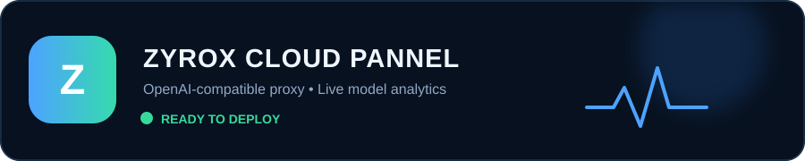

<p align="center">
  
</p>

<p align="center">
  
  
  
  <a href="../../actions/workflows/health-check.yml"></a>
</p>

# ZYROX CLOUD PANNEL

> A secure, Render-ready **OpenAI-compatible API proxy** with a protected live operational dashboard.

## ✨ Live Control Centre

| Dashboard feature | What it shows |
|---|---|
| **Live model test** | On-demand upstream connectivity and latency test for each configured model |
| **Traffic metrics** | Requests today, all-time requests, successful and failed request count |
| **Model analysis** | Per-model request count, success rate, last use time and last measured latency |
| **Recent activity** | Bounded request result history with 80-character prompt previews |
| **Protected access** | Dashboard requires `DASHBOARD_KEY`; client API requires `ACCESS_TOKEN` |

## 🔐 Security rules

- Set `PUTER_TOKEN` **only** in Render environment variables. It is never exposed to browsers or returned from the API.
- Use different, long random values for `ACCESS_TOKEN` and `DASHBOARD_KEY`.
- Never commit `.env`, `stats.json`, GitHub personal access tokens, or provider keys.
- Set `CORS_ORIGIN` to your own website origin if a browser frontend is using the API. Do not leave `*` for a public production frontend.

## 🚀 Deploy on Render

1. Create a **private** GitHub repository named `ZYROXcloud`.
2. Push this project to the repository — commands are below.
3. In Render, choose **New → Blueprint**, connect the repo and deploy `render.yaml`.
4. Add a freshly created Puter token in Render as `PUTER_TOKEN`.
5. Save the generated `ACCESS_TOKEN` and `DASHBOARD_KEY` somewhere secure.
6. Open `https://YOUR-SERVICE.onrender.com/`, enter `DASHBOARD_KEY`, and use the live dashboard.

### Render environment variables

| Key | Required | Purpose |
|---|---:|---|
| `PUTER_TOKEN` | Yes | Private upstream Puter credential |
| `ACCESS_TOKEN` | Yes | Bearer token required by `/v1/*` client endpoints |
| `DASHBOARD_KEY` | Yes | Key required to view analytics at `/` |
| `DEFAULT_MODEL` | No | Default: `anthropic/claude-sonnet-5` |
| `MODELS` | No | Comma-separated models shown/tested in dashboard |
| `CORS_ORIGIN` | No | Allowed browser origin; replace `*` in production |

## ⚡ API examples

### Chat completion

```bash
curl https://YOUR-SERVICE.onrender.com/v1/chat/completions \
  -H "Authorization: Bearer YOUR_ACCESS_TOKEN" \
  -H "Content-Type: application/json" \
  -d '{
    "model": "anthropic/claude-sonnet-5",
    "messages": [{"role": "user", "content": "Hello"}],
    "max_tokens": 500
  }'
```

### List configured models

```bash
curl https://YOUR-SERVICE.onrender.com/v1/models \
  -H "Authorization: Bearer YOUR_ACCESS_TOKEN"
```

### Verify running status

```bash
curl https://YOUR-SERVICE.onrender.com/health
# {"ok":true,"service":"Zyrox Cloud Pannel","configured":true}
```

## 📡 README running-status badge

The GitHub Actions badge at the top can monitor the deployed `/health` endpoint every 15 minutes.

After deploying, open GitHub repository **Settings → Secrets and variables → Actions → New repository secret** and add:

```text
Name:  RENDER_URL
Value: https://YOUR-SERVICE.onrender.com
```

Then select **Actions → Render health monitor → Run workflow** once. The badge turns green after a successful health check.

## 💾 Analytics persistence

This starter stores analytics in `stats.json`. Render free instances use ephemeral storage, so counters can reset after a restart or deploy. For reliable production analytics and multiple instances, migrate these counters to Render Postgres or Redis.

## 📁 Project map

```text
server.js                         Secure Express proxy and analytics API
dashboard.html                    Protected live dashboard UI
render.yaml                       Render Blueprint configuration
.github/workflows/health-check.yml  Scheduled public health monitor
assets/zyrox-status.svg           Animated README header
.env.example                      Safe environment variable template
```
